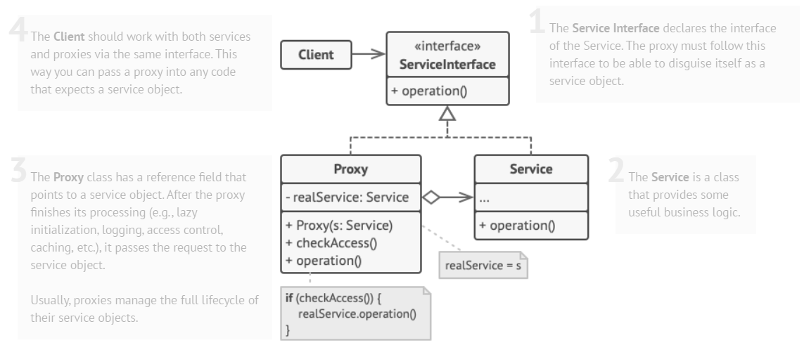

Proxy is a structural design pattern that lets you provide a substitute or placeholder for another object. 
A proxy controls access to the original object, allowing you to perform something either before or after
the request gets through to the original object.

There are dozens of ways to utilize the Proxy pattern. Let’s go over the most popular uses.
1. Lazy initialization (virtual proxy). 
   This is when you have a heavyweight service object that wastes system resources by being always up, even though you only need it from time to time.
2. Access control (protection proxy). 
   This is when you want only specific clients to be able to use the service object; 
   for instance, when your objects are crucial parts of an operating system and clients are various launched applications (including malicious ones).
3. Local execution of a remote service (remote proxy).
   This is when the service object is located on a remote server.
4. Caching request results (caching proxy).
   This is when you need to cache results of client requests and manage the life cycle of this cache, especially if results are quite large.
5. Logging requests (logging proxy). 
   This is when you want to keep a history of requests to the service object.